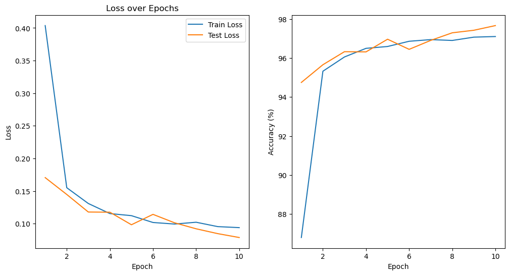

# Entry_problems
# 任务一：半月集分类

分类前半月集数据如图所示：

分类后结果：

​	

# 任务二：基于numpy的mnist图像分类

训练过程中准确率与损失函数图像：

测试集测试结果：

# 任务三：基于pytorch的mnist图像分类

分别采用lenet、vgg、resnet-18以及vit测试其在mnist数据集上的准确度，训练过程对比图如下所示：

vit结果如下所示：

测试集测试结果：

|   模型    | 准确率 |
| :-------: | :----: |
|   lenet   | 98.5%  |
| resnet-18 | 98.6%  |
|    VGG    | 98.7%  |
|    VIT    | 97.67% |

# 任务四：Tiny-VOC图像分类

首先将Annotations中的图像标注转化为模型可处理的迭代器，再分别测试任务三中的四种模型在VOC上的准确度，下面是训练过程中对比图：

vit结果如下所示：

测试集测试结果：

|   模型    | 准确率 |
| :-------: | :----: |
|   lenet   |  96%   |
| resnet-18 | 97.9%  |
|    VGG    | 98.1%  |
|    VIT    | 97.28% |
